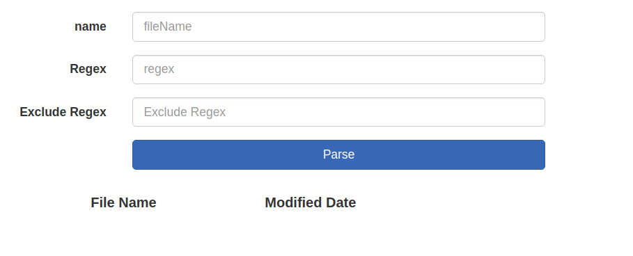
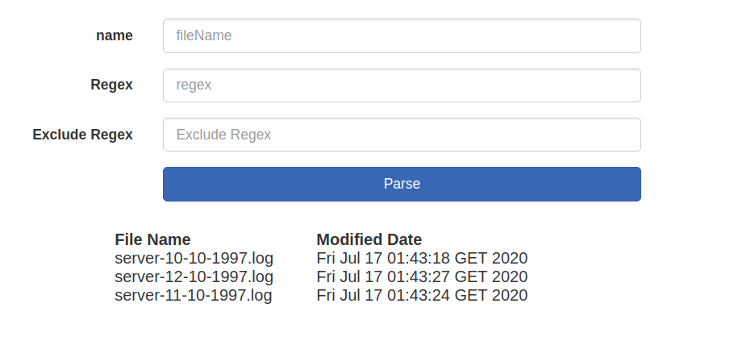

<h1>Welcome to Log-Parser</h1>

Log-Parser is an open source project, that is designed to parse huge 
log files that can't be opened in regular text editors.
Log-Parser searches lines that match with regex in given file huge.
it prints matched lines in output file (matched lines are few enough for regular text editors)

 
project uses spring java 1.8 and spring boot 2.1.8

<h2>Usages</h2>
<ul>
<li>start spring application</li>
<li>go to http://localhost:18018/list</li>
<li>choose file from listed file names and write name</li>
<li>write regex to search</li>
<li>press search button</li>
<li>open output text file</li>
</ul>

 

